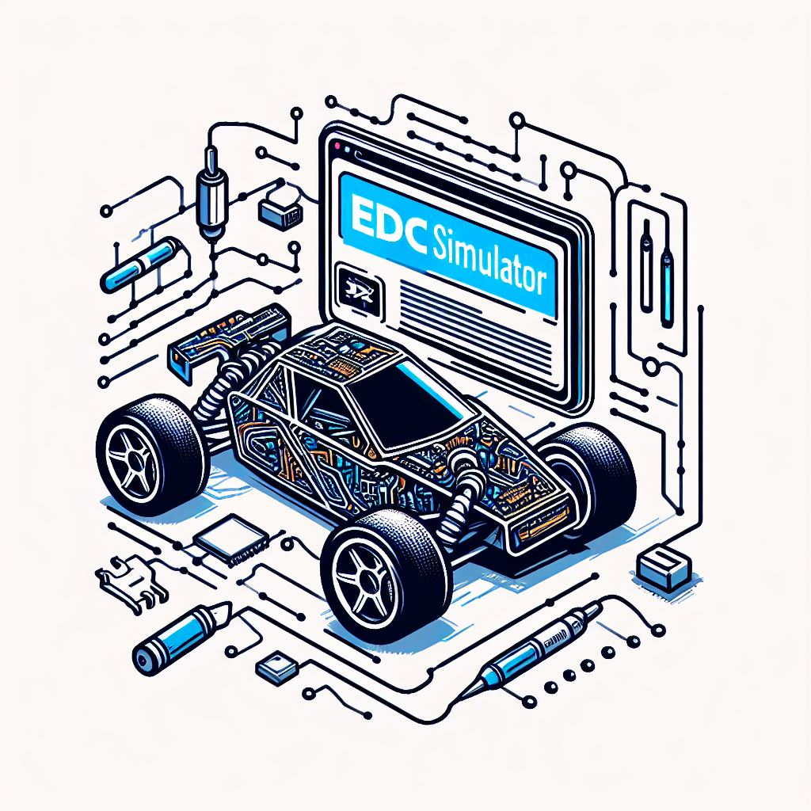

# EDC-Simulator


A simulator for EDC25

<div align="center">
	
</div>


## Some Package Requirements

- pygame
- pyvirtualcam
- pyQt5

Thanks for their preceding work!

## Getting Started

Install [OBS Studio](https://obsproject.com/)

Install the requirements:
```
pip install -r requirements.txt
```

### Automatic Version

Run `src/automatic/main.py`

Control the movement by serial port data
- `goal pos:(float,float)`
- `now pos:(float,float)`

### Manual Version

Run `src/manual/main.py`

Control the movement by keys
- `W` or `↑`
- `A` or `←`
- `S` or `↓`
- `D` or `→`